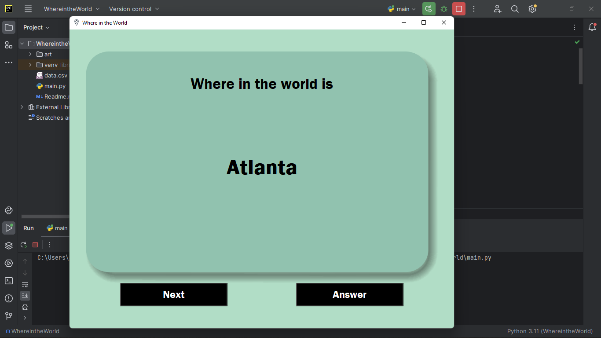
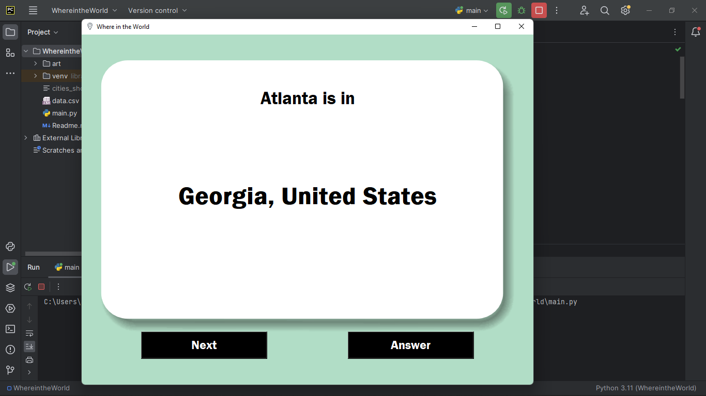

# Where in the World

"Where in the World" is an application built using the Tkinter library of Python. It has a flash card-style UI that presents the user with the name of a random city, allowing them to guess its subdivision and country. The app is designed for geographic knowledge enhancement and interactive learning.

## Features
* Random city name display from a data file containing around 600 cities around the world.
* "Answer" button reveals the subdivision and country name.
* "Next" button to skip and display a different city.
* Stores already shown cities in a text file and avoids displaying it again.

## File Structure
- `main.py`: Main application script. Run this.
- `data.csv`: CSV file containing the data.
- `displayed_cities.txt`: Text file storing cities that are already displayed. Generated only after the application is run. Delete this file to reset progress.

## Screenshots
### City

### Country

